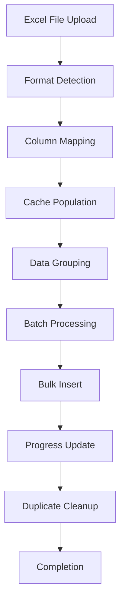

# 📊 BioWings Excel Import Sistemi

## 📋 Genel Bakış

BioWings projesi, Excel dosyalarından **Observation** ve **Species** verilerini import etmek için gelişmiş bir sistem kullanır. Bu sistem:

- ✅ **5 Farklı Format Desteği**: Otomatik format tanıma ve column mapping
- ✅ **Drag & Drop Interface**: Modern dosya yükleme arayüzü  
- ✅ **Template System**: Hazır Excel şablonları ve mock data
- ✅ **Real-time Progress**: SignalR ile canlı ilerleme takibi
- ✅ **Batch Processing**: 1500'lük gruplarla hızlı işleme
- ✅ **Memory Cache**: İlişkili verileri cache'de tutma
- ✅ **Bulk Insert**: Database'e toplu ekleme
- ✅ **Duplicate Prevention**: Otomatik tekrar önleme
- ✅ **XLS/XLSX Support**: Her iki format desteği

## 🎯 Import Türleri

### 1. Observation Import
- **Endpoint**: `/api/Observations/ImportAllFormat`
- **Sayfa**: `/Import/Index`
- **Desteklenen Formatlar**: Format1, Format2, Format3, Format4, Format5
- **Max Dosya Boyutu**: 50MB

### 2. Species Import  
- **Endpoint**: `/api/Species/Import`
- **Modal**: Species sayfasında modal pencere
- **Desteklenen Formatlar**: Format1, Format2
- **Max Dosya Boyutu**: 50MB

## 🔧 Sistem Mimarisi

### Backend Components

```csharp
// Ana servis interface
public interface IExcelImportService
{
    Task<List<ImportCreateDto>> ImportFromExcelAsync(IFormFile file);
    List<ImportCreateSpeciesDto> ImportSpeciesFromExcel(IFormFile file);
}

// Format detection
public static class ExcelFormatDetectorHelper
{
    public static string DetectFormat(ExcelWorksheet worksheet);
    public static string DetectFormatForSpeciesImport(ExcelWorksheet worksheet);
}

// Column mapping system
public class ExcelMapping
{
    public Dictionary<string, string[]> ColumnMappings { get; set; }
    public int HeaderRow { get; set; } = 1;
    public int DataStartRow { get; set; } = 2;
}
```

## 📄 Excel Template Sistemi

### Template İndirme

```javascript
// Template indirme
document.querySelector('#downloadTemplate').addEventListener('click', async (e) => {
    const response = await fetch(`${API_CONFIG.BASE_URL}/ExcelTemplate/download`);
    const blob = await response.blob();
    
    const url = window.URL.createObjectURL(blob);
    const a = document.createElement('a');
    a.href = url;
    a.download = "observation_import_template.xlsx";
    a.click();
});
```

### Default Template (Format4) - Kapsamlı Yapı

#### Observation Template - Tam Column Listesi:
```
Authority Name, Year, Family Name, Genus Name, Subspecies Name,
Scientific Name, Name, EU Name, Full Name, Turkish Name, English Name,
Turkish Names Trakel, Trakel, Kocak Name, Hesselbarth Name,
Province Name, Province Code, Square Ref, Square Latitude, Square Longitude,
Latitude, Longitude, Decimal Degrees, Degrees Minutes Seconds, Decimal Minutes,
UTM Coordinates, MGRS Coordinates, Altitude 1, Altitude 2, UTM Reference,
Coordinate Precision Level, Observer Name, Observer Surname, Observer Full Name,
Sex, Observation Date, Life Stage, Number Seen, Notes, Source, Location Info
```

#### Species Template Headers:
```
Authority Name, Authority Year, Family Name, Genus Name, Scientific Name,
Species Name, EU Name, Full Name, Turkish Name, English Name,
Turkish Names Trakel, Trakel, Kocak Name, Hesselbarth Name
```


> *Format1, Format2, Format5'te tarih ayrı kolonlarda: Day, Month, Year

### Data Type Validation

```csharp
// Koordinat doğrulama
private decimal GetDecimalValue(ExcelWorksheet worksheet, int row, Dictionary<string, int> columnMappings, string propertyName, decimal defaultValue = 0)
{
    if (columnMappings.TryGetValue(propertyName, out int column))
    {
        var value = worksheet.Cells[row, column].Text?.Replace(',', '.');
        if (decimal.TryParse(value, NumberStyles.Any, CultureInfo.InvariantCulture, out decimal result))
        {
            return propertyName.Contains("Latitude")
                ? Math.Max(-90, Math.Min(90, result))      // Latitude: -90 to 90
                : propertyName.Contains("Longitude") 
                ? Math.Max(-180, Math.Min(180, result))    // Longitude: -180 to 180
                : result;
        }
    }
    return defaultValue;
}

// Tarih parsing (özel helper)
public static DateTime ParseObservationDate(ExcelWorksheet worksheet, int row, Dictionary<string, int> columnMappings)
{
    // Format3 için direkt date column
    if (columnMappings.ContainsKey("date"))
    {
        var dateValue = worksheet.Cells[row, columnMappings["date"]].Text;
        if (DateTime.TryParse(dateValue, out DateTime parsedDate))
            return parsedDate;
    }
    
    // Format1,2,5 için ayrı Day, Month, Year columnları
    var day = GetIntValue(worksheet, row, columnMappings, "Day", 1);
    var month = GetIntValue(worksheet, row, columnMappings, "Month", 1);
    var year = GetIntValue(worksheet, row, columnMappings, "Year", DateTime.Now.Year);
    
    return new DateTime(year, month, day);
}
```

## 🎮 Kullanım Kılavuzu

### 1. Observation Import

#### Adım 1: Import Sayfasına Git
```
/Import/Index
```

#### Adım 2: Template İndir (Opsiyonel)
- "Download Template" linkine tıkla
- Excel dosyasını doldur

#### Adım 3: Dosya Yükle
- Dosyayı drag & drop ile bırak
- Veya "click to upload" ile seç
- Desteklenen formatlar: `.xlsx`, `.xls`
- Max boyut: 50MB

#### Adım 4: Import Et
- "Import Data" butonuna tıkla
- İlerleme çubuğunu takip et
- Sonuçları görüntüle

### 2. Species Import

#### Species Sayfasında Modal:
```javascript
// Species modal'ı aç
$('#kt_import_modal').modal('show');

// Dosya seç ve import et
// Otomatik progress takibi
```

## 🔍 Format Detection ve Column Mapping Sistemi

### Desteklenen 5 Format

| Format | Kaynak | Tanıma Özelliği | Zorunlu Alanlar |
|--------|---------|-----------------|-----------------|
| **Format1** | DKM data All data_Mar2014_Ayse | "Province No:" | Genus, Species, X, Y |
| **Format2** | Hesselbarth et al 1995 data | "Raw Record" | Genus, Species, Enlem, Boylam |
| **Format3** | Tablib Dataset observations-dkm-vakfi_2023 | "lat" + "lng" | scientific name, lat, lng |
| **Format4** | Default Template | "Authority Name" | Authority Name, Species Name |
| **Format5** | Mixed obs since 1995 | "Day 1" | Genus, Species, X, Y |

### Otomatik Format Detection

```csharp
public static string DetectFormat(ExcelWorksheet worksheet)
{
    var headers = GetHeaders(worksheet, 1);

    return headers.Contains("Province No:") ? "Format1"      // DKM Format
         : headers.Contains("Raw Record") ? "Format2"        // Hesselbarth Format  
         : headers.Contains("Day 1") ? "Format5"             // Mixed Daily Format
         : headers.Contains("lat") && headers.Contains("lng") ? "Format3"  // GPS Format
         : headers.Contains("Authority Name") ? "Format4"    // Template Format
         : "Format4"; // Default to template
}
```

### Column Mapping Sistemi

Her format için esnek header mapping tanımlı:

#### Format1 (DKM Data) - Mapping Örneği:
```csharp
"Format1", new ExcelMapping {
    ColumnMappings = new Dictionary<string, string[]> {
        // Taxonomy
        { "GenusName", new[] { "Genus" } },
        { "SpeciesName", new[] { "Species" } },
        { "FullName", new[] { "Full name" } },
        
        // Location  
        { "ProvinceCode", new[] { "Province No:" } },
        { "ProvinceName", new[] { "Province" } },
        { "Latitude", new[] { "X" } },        // X koordinat Latitude olarak
        { "Longitude", new[] { "Y" } },       // Y koordinat Longitude olarak
        { "SquareRef", new[] { "Square" } },
        { "LocationInfo", new[] { "Location" } },
        
        // Observer & Date
        { "ObserverName", new[] { "Observer" } },
        { "Source", new[] { "Source" } },
        { "Day", new[] { "Day" } },
        { "Month", new[] { "Month" } },
        { "Year", new[] { "Year" } }
    }
}
```

#### Format4 (Default Template) - Tam Mapping:
```csharp
"Format4", new ExcelMapping {
    ColumnMappings = new Dictionary<string, string[]> {
        // Authority & Taxonomy
        { "AuthorityName", new[] { "Authority Name" } },
        { "AuthorityYear", new[] { "Year" } },
        { "GenusName", new[] { "Genus Name" } },
        { "FamilyName", new[] { "Family Name" } },
        { "ScientificName", new[] { "Scientific Name" } },
        { "SpeciesName", new[] { "Name" } },
        { "EUName", new[] { "EU Name" } },
        { "FullName", new[] { "Full Name" } },
        { "TurkishName", new[] { "Turkish Name" } },
        { "EnglishName", new[] { "English Name" } },
        { "SubspeciesName", new[] { "Subspecies Name" } },
        
        // Location Details
        { "ProvinceName", new[] { "Province Name" } },
        { "ProvinceCode", new[] { "Province Code" } },
        { "Latitude", new[] { "Latitude" } },
        { "Longitude", new[] { "Longitude" } },
        { "Altitude1", new[] { "Altitude 1" } },
        { "Altitude2", new[] { "Altitude 2" } },
        
        // Observer
        { "ObserverName", new[] { "Observer Name" } },
        { "ObserverSurname", new[] { "Observer Surname" } },
        { "ObserverFullName", new[] { "Observer Full Name" } },
        
        // Observation Details
        { "Sex", new[] { "Sex" } },
        { "ObservationDate", new[] { "Observation Date" } },
        { "LifeStage", new[] { "Life Stage" } },
        { "NumberSeen", new[] { "Number Seen" } },
        { "Notes", new[] { "Notes" } },
        { "Source", new[] { "Source" } }
    }
}
```

## 🚀 API Endpoints

### Observation Import

```csharp
[HttpPost("ImportAllFormat")]
[AuthorizeDefinition("Gözlem Yönetimi", ActionType.Write, 
                    "Tüm formatlarla gözlem import etme", AreaNames.Admin)]
public async Task<IActionResult> ImportAllFormat([FromForm] IFormFile file)
{
    var command = new ObservationImportAllFormatCreateCommand { File = file };
    var result = await mediator.Send(command);
    return CreateResult(result);
}
```

### Species Import

```csharp
[HttpPost("Import")]
[AuthorizeDefinition("Species", ActionType.Write, 
                    "Import ile Tür Ekleme", AreaNames.Public)]
public async Task<IActionResult> ImportSpecies([FromForm] IFormFile file)
{
    var command = new SpeciesImportCreateCommand { File = file };
    var result = await mediator.Send(command);
    return CreateResult(result);
}
```

### Template Download

```csharp
[HttpGet("download")]
[AuthorizeDefinition("Şablon İndirme", ActionType.Read, 
                    "Gözlem import şablonu indirme", AreaNames.Public)]
public IActionResult DownloadTemplate()
{
    var fileContents = excelTemplateService.CreateImportTemplateWithMockData();
    return File(fileContents, 
               "application/vnd.openxmlformats-officedocument.spreadsheetml.sheet",
               "observation_import_template.xlsx");
}
```

## 📱 Frontend Implementation

### Dropzone Konfigürasyonu

```javascript
const initDropzone = () => {
    dropzone = new Dropzone("#importDropzone", {
        url: "#",
        paramName: "file",
        maxFiles: 1,
        maxFilesize: 50,
        acceptedFiles: ".xlsx,.xls",
        autoProcessQueue: false,
        addRemoveLinks: true,
        createImageThumbnails: false,
        
        dictDefaultMessage: "Drop Excel files here or click to upload",
        dictFileTooBig: "File is too big ({{filesize}}MB). Max filesize: {{maxFilesize}}MB.",
        dictInvalidFileType: "Only Excel files (.xlsx, .xls) are allowed.",
        dictMaxFilesExceeded: "Only one file can be uploaded at a time."
    });
};
```

### API Request

```javascript
const handleSubmit = async () => {
    const formData = new FormData();
    formData.append('file', dropzone.files[0]);

    const response = await fetch(`${API_CONFIG.BASE_URL}/Observations/ImportAllFormat`, {
        method: 'POST',
        body: formData,
        credentials: 'include'
    });

    const result = await response.json();
    
    if (result.isSuccess) {
        toastr.success("Import completed successfully!");
    } else {
        toastr.error(result.message || "Import failed");
    }
};
```

## 🚀 Batch Processing ve Performance

### Memory Cache Sistemi

Import sırasında ilişkili veriler cache'de tutulur:

```csharp
private Dictionary<string, Family> _familyCache = new();
private Dictionary<GenusKey, Genus> _genusCache = new();
private Dictionary<string, Observer> _observerCache = new();
private Dictionary<AuthorityKey, Authority> _authorityCache = new();
private Dictionary<LocationKey, Location> _locationCache = new();
private Dictionary<SpeciesKey, Species> _speciesCache = new();
```

### Batch Processing (1500'lük Gruplar)

```csharp
const int batchSize = 1500;
var batchObservations = new List<Observation>();

// Her 1500 kayıtta bulk insert
if (batchObservations.Count >= batchSize)
{
    await observationRepository.BulkInsertObservationsAsync(batchObservations, cancellationToken);
    totalProcessed += batchObservations.Count;
    observationImportProgressTracker.IncrementProgress(batchObservations.Count);
    logger.LogInformation($"Batch processed: {totalProcessed}/{importDtos.Count}");
    batchObservations.Clear();
    unitOfWork.GetContext().ChangeTracker.Clear(); // Memory temizleme
}
```

## 🔑 Key Sistemi ve Uniqueness Logic

### Composite Key Mantığı

Import sistemi, veritabanında unique kayıtları tanımlamak için composite key'ler kullanır:

#### 1. **SpeciesKey** - Tür Benzersizliği
```csharp
public record SpeciesKey(string Name, int? GenusId, int? AuthorityId);
```
**Mantık**: Aynı isimde türler, farklı genus ve authority'lere sahip olabilir.
- Örnek: "argus" türü hem Plebeius hem de Aricia cinsinde bulunabilir  
- Authority'ler de kritik: "Linnaeus, 1758" vs "Fabricius, 1777"

#### 2. **AuthorityKey** - Otorite Benzersizliği  
```csharp
public record AuthorityKey(string Name, int Year);
```
**Mantık**: Aynı isimde farklı yıllarda otoriteler olabilir.
- Örnek: "Linnaeus, 1758" vs "Linnaeus, 1767"

#### 3. **GenusKey** - Cins Benzersizliği
```csharp
public record GenusKey(string GenusName, int? FamilyId);
```
**Mantık**: Aynı cins adı farklı familyalarda bulunabilir.
- Örnek: "Vanessa" hem Nymphalidae hem de başka familyada

#### 4. **LocationKey** - Konum Benzersizliği
```csharp
public record LocationKey(decimal Latitude, decimal Longitude);
```
**Mantık**: GPS koordinatları tamamen unique olmalı.
- Hassasiyet: 6 decimal (±0.1 metre)

### Database Unique Index Stratejisi

```sql
-- Species uniqueness constraint
CREATE INDEX IX_Species_Name_GenusId_AuthorityId ON Species (Name, GenusId, AuthorityId);

-- Authority uniqueness
CREATE UNIQUE INDEX IX_Authority_Name_Year ON Authority (Name, Year);

-- Location coordinate uniqueness  
CREATE UNIQUE INDEX IX_Location_Coordinates ON Location (Latitude, Longitude);
```

### Cache Lookup Mantığı

```csharp
// Species cache lookup örneği
var speciesKey = new SpeciesKey(dto.SpeciesName, genus?.Id, authority?.Id);
var species = !string.IsNullOrEmpty(dto.SpeciesName) && 
              _speciesCache.TryGetValue(speciesKey, out var existingSpecies)
    ? existingSpecies
    : await CreateBatchSpeciesAsync(dto, genus?.Id, authority?.Id, cancellationToken);

// Location cache lookup örneği  
var locationKey = new LocationKey(dto.Latitude, dto.Longitude);
var location = _locationCache.TryGetValue(locationKey, out var existingLocation)
    ? existingLocation
    : await CreateBatchLocationAsync(dto, group.Key.ProvinceCode, cancellationToken);
```

## 🔧 Duplicate Management Sistemi

### Observation Duplicate Detection

Gözlem kayıtlarında duplicate tanıma kriterleri:

```csharp
// Observation duplicate check - 9 alan kombinasyonu
var duplicateKey = new {
    SpeciesId,
    LocationId, 
    ObserverId,
    ObservationDate,
    LocationInfo,
    Notes,
    Source,
    NumberSeen,
    Sex
};
```

### Batch Duplicate Cleanup

Import sonrası otomatik duplicate temizleme:

```csharp
private async Task CleanDuplicateObservations(CancellationToken cancellationToken)
{
    // MySQL stored procedure ile duplicate cleanup
    await observationRepository.RemoveDuplicatesWithProcedureAsync(
        "CALL CleanDuplicateObservations()", cancellationToken);
    
    logger.LogInformation("Removed duplicate observations successfully.");
}
```

### Duplicate Detection SQL

```sql
-- Duplicate observations bulma query'si
SELECT o.Id FROM Observations o
INNER JOIN (
    SELECT SpeciesId, LocationId, ObserverId, ObservationDate,
           LocationInfo, Notes, Source, NumberSeen
    FROM Observations
    GROUP BY SpeciesId, LocationId, ObserverId, ObservationDate,
             LocationInfo, Notes, Source, NumberSeen
    HAVING COUNT(*) > 1
) AS dups 
ON o.SpeciesId = dups.SpeciesId
   AND o.LocationId = dups.LocationId
   AND ((o.ObserverId IS NULL AND dups.ObserverId IS NULL) OR o.ObserverId = dups.ObserverId)
   AND o.ObservationDate = dups.ObservationDate
   AND ((o.LocationInfo IS NULL AND dups.LocationInfo IS NULL) OR o.LocationInfo = dups.LocationInfo)
   AND ((o.Notes IS NULL AND dups.Notes IS NULL) OR o.Notes = dups.Notes)
   AND ((o.Source IS NULL AND dups.Source IS NULL) OR o.Source = dups.Source)
   AND o.NumberSeen = dups.NumberSeen
WHERE o.Id NOT IN (
    SELECT MIN(Id) FROM Observations
    GROUP BY SpeciesId, LocationId, ObserverId, ObservationDate,
             LocationInfo, Notes, Source, NumberSeen
         HAVING COUNT(*) > 1
)
```

## 📡 SignalR Real-Time Progress Tracking

### ProgressHub Konfigürasyonu

```csharp
[EnableCors("AllowSpecificOrigin")]
public class ProgressHub : Hub
{
    public async Task JoinGroup(string groupName)
    {
        await Groups.AddToGroupAsync(Context.ConnectionId, groupName);
        await Clients.Group(groupName).SendAsync("UserJoined", Context.ConnectionId);
    }

    public async Task LeaveGroup(string groupName)  
    {
        await Groups.RemoveFromGroupAsync(Context.ConnectionId, groupName);
        await Clients.Group(groupName).SendAsync("UserLeft", Context.ConnectionId);
    }
}
```

### Progress Tracking Service

```csharp
public class ObservationImportProgressTracker(IHubContext<ProgressHub> hubContext) 
    : IObservationImportProgressTracker
{
    private int _totalRecords;
    private int _processedRecords;
    private readonly string _groupName = "ImportProgress";

    public void SetTotalRecords(int totalRecords)
    {
        _totalRecords = totalRecords;
    }

    public async void IncrementProgress(int incrementBy = 1)
    {
        _processedRecords += incrementBy;
        var progress = new ProgressInfo
        {
            Progress = (_processedRecords * 100) / _totalRecords,
            ProcessedRecords = _processedRecords,
            TotalRecords = _totalRecords,
            RemainingRecords = _totalRecords - _processedRecords,
            Message = $"Processing: {_processedRecords}/{_totalRecords}"
        };

        await hubContext.Clients.Group(_groupName)
            .SendAsync("ProgressUpdate", progress);
    }
}
```

### Frontend SignalR Connection

```javascript
// SignalR connection kurulum
const connection = new signalR.HubConnectionBuilder()
    .withUrl("/progressHub")
    .build();

connection.start().then(function () {
    console.log("SignalR Connected.");
    connection.invoke("JoinGroup", "ImportProgress");
}).catch(function (err) {
    console.error("SignalR Connection Error: ", err.toString());
});

// Progress update handler
connection.on("ProgressUpdate", function (progressInfo) {
    updateProgressUI(progressInfo);
});

function updateProgressUI(progress) {
    const progressBar = document.getElementById('progressBar');
    const progressText = document.getElementById('progressText');
    
    progressBar.style.width = progress.progress + '%';
    progressBar.setAttribute('aria-valuenow', progress.progress);
    
    progressText.innerHTML = `
        <div>Progress: ${progress.progress}%</div>
        <div>${progress.processedRecords}/${progress.totalRecords} records</div>
        <div>Remaining: ${progress.remainingRecords}</div>
    `;
}
```

### Real-Time Import Flow

```csharp
// Import başlangıcında
observationImportProgressTracker.SetTotalRecords(importDtos.Count);

// Her batch işleminde
foreach (var group in groupedData)
{
    // ... data processing ...
    
    if (batchObservations.Count >= batchSize)
    {
        await observationRepository.BulkInsertObservationsAsync(batchObservations, cancellationToken);
        
        // Real-time progress update 🚀
        observationImportProgressTracker.IncrementProgress(batchObservations.Count);
        
        totalProcessed += batchObservations.Count;
        logger.LogInformation($"Batch processed: {totalProcessed}/{importDtos.Count}");
        batchObservations.Clear();
    }
}
```

## 🎯 ObservationImportAllFormatCreateCommandHandler Detayları

### İşlem Akışı



### Handler İmplementasyonu

```csharp
public async Task<ServiceResult> Handle(
    ObservationImportAllFormatCreateCommand request, 
    CancellationToken cancellationToken)
{
    // 1. Format detection ve data extraction
    var importResult = await excelImportService.ImportObservationDataAsync(
        request.File, cancellationToken);
    
    // 2. Cache population - hızlı lookup için
    PopulateCaches();
    
    // 3. Transaction ve batch processing
    await context.Database.CreateExecutionStrategy().ExecuteAsync(async () =>
    {
        await using var transaction = await context.Database.BeginTransactionAsync(cancellationToken);
        try
        {
            // 4. Data grouping - efficiency için
            var groupedData = importDtos.GroupBy(x => new
            {
                x.AuthorityName, x.AuthorityYear, x.FamilyName, 
                x.GenusName, x.ProvinceName, x.ProvinceCode, x.ObserverFullName
            }).ToList();

            // 5. Batch processing - 1500'lük gruplar
            foreach (var group in groupedData)
            {
                await ProcessGroupBatch(group, cancellationToken);
            }

            await transaction.CommitAsync(cancellationToken);
        }
        catch (Exception)
        {
            await transaction.RollbackAsync(cancellationToken);
            throw;
        }
    });

    // 6. Duplicate cleanup - son aşama
    await CleanDuplicateObservations(cancellationToken);
    
    return ServiceResult.Success();
}
```

### Cache Performance Metrics

```csharp
// Cache miss/hit oranları
logger.LogInformation($"Cache Performance Summary:");
logger.LogInformation($"- Species Cache: {_speciesCache.Count} entries");
logger.LogInformation($"- Location Cache: {_locationCache.Count} entries");  
logger.LogInformation($"- Authority Cache: {_authorityCache.Count} entries");
logger.LogInformation($"- Family Cache: {_familyCache.Count} entries");
logger.LogInformation($"- Observer Cache: {_observerCache.Count} entries");
```

## 📋 Zorunlu Alanlar ve Validasyon

### 🔴 Critical Fields - Her Format İçin Zorunlu

| Alan | Format1 | Format2 | Format3 | Format4 | Format5 | Açıklama |
|------|---------|---------|---------|---------|---------|----------|
| **Species Name** | ✅ | ✅ | ✅ | ✅ | ✅ | Tür adı (her durumda zorunlu) |
| **Latitude** | ✅ (X) | ✅ (Enlem) | ✅ (lat) | ✅ | ✅ (X) | GPS koordinat |
| **Longitude** | ✅ (Y) | ✅ (Boylam) | ✅ (lng) | ✅ | ✅ (Y) | GPS koordinat |

### 🟡 Conditional Fields - Format Bağımlı Zorunlu

| Alan | Format1 | Format2 | Format3 | Format4 | Format5 | Validasyon Kuralı |
|------|---------|---------|---------|---------|---------|-------------------|
| **Genus Name** | ✅ | ✅ | - | ✅ | ✅ | Species varsa zorunlu |
| **Family Name** | - | - | - | ✅ | - | Template formatında zorunlu |
| **Authority Name** | - | - | - | ✅ | - | Template formatında zorunlu |
| **Authority Year** | - | - | - | ✅ | - | Authority Name varsa zorunlu |
| **Observation Date** | ✅* | ✅* | ✅ | ✅ | ✅* | Her formatta zorunlu |

> *Format1, Format2, Format5'te tarih ayrı kolonlarda: Day, Month, Year

### 🟢 Optional Fields - Her Format

| Alan Grubu | Alanlar | Varsayılan İşlem |
|------------|---------|------------------|
| **Observer** | Observer Name/Surname/Full Name | Boş ise "Unknown Observer" |
| **Location Details** | Province, Square Ref, Altitude | GPS'ten otomatik bulunur |
| **Observation Info** | Sex, Life Stage, Number Seen | Boş ise default değerler |
| **Additional** | Notes, Source, Location Info | Opsiyonel |

### Data Type Validation Rules

```csharp
// Coordinate validation
if (latitude < -90 || latitude > 90 || longitude < -180 || longitude > 180)
    throw new ValidationException("Invalid GPS coordinates");

// Date validation  
if (observationDate > DateTime.Now || observationDate < new DateTime(1800, 1, 1))
    throw new ValidationException("Invalid observation date");

// Authority year validation
if (authorityYear.HasValue && (authorityYear < 1750 || authorityYear > DateTime.Now.Year))
    throw new ValidationException("Invalid authority year");
```

### Bulk Insert Implementation

```csharp
public async Task BulkInsertObservationsAsync(IList<Observation> observations, CancellationToken cancellationToken = default)
{
    await BulkInsertAsync("observations", observations, cancellationToken);
}
```

### Transaction Yönetimi

```csharp
await unitOfWork.ExecuteInTransactionAsync(async (transaction) =>
{
    try
    {
        // Batch işlemleri
        await transaction.CommitAsync(cancellationToken);
        return ServiceResult.Success();
    }
    catch (Exception)
    {
        await transaction.RollbackAsync(cancellationToken);
        throw;
    }
});
```

## 📡 SignalR ile Real-Time Progress Tracking

### Backend - ProgressHub

```csharp
public class ProgressHub : Hub
{
    public async Task UpdateProgress(ProgressInfo progress)
    {
        await Clients.All.SendAsync("ReceiveProgress", progress);
    }
}

public class ProgressInfo
{
    public int Progress { get; set; }      // 0-100 yüzde
    public string Message { get; set; }    // "Processing record 150 of 1000"
    public string Status { get; set; }     // "Processing" | "Completed" | "Error"
}
```

### Progress Tracker Service

```csharp
public class ObservationImportProgressTracker : IObservationImportProgressTracker
{
    private int _totalRecords;
    private int _currentRecord;
    
    public void SetTotalRecords(int total)
    {
        _totalRecords = total;
        _currentRecord = 0;
        UpdateProgress();
    }

    public void IncrementProgress(int count = 1)
    {
        _currentRecord += count;
        UpdateProgress();
    }

    private void UpdateProgress()
    {
        var progress = _totalRecords > 0 ? _currentRecord * 100 / _totalRecords : 0;
        progressTracker.UpdateProgress(new ProgressInfo
        {
            Progress = progress,
            Message = $"Processing record {_currentRecord} of {_totalRecords}",
            Status = progress == 100 ? "Completed" : "Processing"
        });
    }
}
```

### Frontend - SignalR Connection

```javascript
const initSignalR = async () => {
    connection = new signalR.HubConnectionBuilder()
        .withUrl(`${API_CONFIG.BASE_URL.replace('/api', '')}/progressHub`)
        .build();

    // Progress event listener
    connection.on("ReceiveProgress", (progress) => {
        updateProgress(progress.progress, progress.message);
        
        if (progress.status === "Completed") {
            progressElement.classList.add('d-none');
            toastr.success("Import completed successfully!");
        }
    });

    try {
        await connection.start();
        console.log("SignalR Connected");
    } catch (err) {
        console.error("SignalR connection error:", err);
        setTimeout(initSignalR, 5000); // Retry connection
    }
};

// Progress bar güncelleme
const updateProgress = (value, message) => {
    const percent = Math.min(100, Math.max(0, value));
    progressBar.style.width = percent + '%';
    progressBar.setAttribute('aria-valuenow', percent);
    progressPercentage.textContent = percent + '%';
    
    if (message) {
        progressText.textContent = message;
    }
};
```

## 🛠️ Data Processing Flow

### 1. File Upload & Validation
```
File Upload → Size Check (50MB) → Format Check (.xlsx/.xls) → Process
```

### 2. Format Detection & Column Mapping  
```
Excel Headers → Auto Format Detection → Column Mapping → Data Extraction
```

### 3. Memory Cache Loading
```
Load Existing: Authority, Family, Genus, Observer, Species, Location → Cache
```

### 4. Batch Processing
```
Group by Related Entities → Process 1500 Records → Bulk Insert → Update Progress
```

### 5. Duplicate Cleanup
```
Bulk Insert Complete → Run Duplicate Cleanup Procedure → Final Progress Update
```

### 6. Transaction Management
```
Begin Transaction → Process Batches → Commit/Rollback → Log Results
```

## 🎯 Column Mapping System

### Flexible Header Matching

```csharp
// Örnek column mapping
var columnMappings = new Dictionary<string, string[]>
{
    ["AuthorityName"] = new[] { "Authority Name", "Authority", "Auth" },
    ["GenusName"] = new[] { "Genus Name", "Genus", "Gen" },
    ["SpeciesName"] = new[] { "Species Name", "Species", "Sp" },
    ["Latitude"] = new[] { "Latitude", "Lat", "Y" },
    ["Longitude"] = new[] { "Longitude", "Lng", "Lon", "X" }
};
```

### Auto-Detection Logic

```csharp
private Dictionary<string, int> CreateColumnMappings(ExcelWorksheet worksheet, ExcelMapping mapping)
{
    var columnMappings = new Dictionary<string, int>();
    
    for (int col = 1; col <= worksheet.Dimension.Columns; col++)
    {
        var headerValue = worksheet.Cells[1, col].Text?.Trim();
        
        foreach (var map in mapping.ColumnMappings)
        {
            if (map.Value.Any(possibleHeader =>
                possibleHeader.Equals(headerValue, StringComparison.OrdinalIgnoreCase)))
            {
                columnMappings[map.Key] = col;
                break;
            }
        }
    }
    
    return columnMappings;
}
```

## ⚠️ Error Handling

### Validation Rules

- **File Size**: Max 50MB
- **File Format**: Only .xlsx, .xls
- **Required Fields**: Species name, observation date
- **Data Format**: Valid coordinates, dates
- **Duplicate Check**: Prevents duplicate entries

### Error Response

```csharp
// Başarısız import response
{
    "isSuccess": false,
    "errorList": [
        "Row 5: Invalid date format",
        "Row 12: Species name is required",
        "Row 18: Invalid coordinates"
    ],
    "message": "Import completed with errors"
}
```

## 🚨 Troubleshooting ve Best Practices

### Common Issues ve Çözümleri

#### 1. Format Detection Hatası
**Problem**: "Excel dosyası boş veya geçersiz format içeriyor"
**Çözüm**: 
- Header row'da format belirteçlerini kontrol et
- Format1: "Province No:" olmalı
- Format2: "Raw Record" olmalı  
- Format3: "lat" ve "lng" birlikte olmalı
- Format4: "Authority Name" olmalı
- Format5: "Day 1" olmalı

#### 2. Column Mapping Hatası
**Problem**: "Column mapping failed"
**Çözüm**:
```csharp
// Header'lar case-insensitive karşılaştırılır
possibleHeader.Equals(headerValue, StringComparison.OrdinalIgnoreCase)

// Farklı header varyasyonları desteklenir:
{ "Latitude", new[] { "Latitude", "Lat", "Y", "Enlem" } }
{ "Longitude", new[] { "Longitude", "Lng", "Lon", "X", "Boylam" } }
```

#### 3. Large File Performance Issues
**Problem**: Büyük dosyalarda timeout
**Çözüm**:
- 50MB limit var, bu aşılmamalı
- 1500'lük batch processing otomatik
- Memory cache temizleme aktif
- Transaction rollback koruması var

#### 4. Duplicate Records
**Problem**: Aynı kayıtlar tekrar ekleniyor
**Çözüm**:
```csharp
// Otomatik duplicate cleanup çalışır
await observationRepository.RemoveDuplicatesWithProcedureAsync("CALL CleanDuplicateObservations()", cancellationToken);

// Duplicate key: SpeciesId + LocationId + ObserverId + ObservationDate + Notes + Source
```

#### 5. SignalR Connection Issues
**Problem**: Progress güncellenmiyor
**Çözüm**:
```javascript
// Connection retry mekanizması
try {
    await connection.start();
} catch (err) {
    console.error("SignalR connection error:", err);
    setTimeout(initSignalR, 5000); // 5 saniye sonra retry
}

// Hub URL kontrolü
connection = new signalR.HubConnectionBuilder()
    .withUrl(`${API_CONFIG.BASE_URL.replace('/api', '')}/progressHub`)
    .build();
```

#### 6. Coordinate Validation Errors
**Problem**: GPS koordinatları hatalı
**Çözüm**:
```csharp
// Otomatik range validation
Latitude: Math.Max(-90, Math.Min(90, result))    // -90 ile 90 arası
Longitude: Math.Max(-180, Math.Min(180, result)) // -180 ile 180 arası

// Province otomatik detection
if (importCreateDto.ProvinceName == null && importCreateDto.Latitude != 0 && importCreateDto.Longitude != 0)
{
    var provinceCode = await geocodingService.GetProvinceAsync(importCreateDto.Latitude, importCreateDto.Longitude);
}
```

### Production Deployment Checklist

✅ **Database**:
- `CleanDuplicateObservations()` stored procedure tanımlı
- Bulk insert permissions set
- Index'ler optimize edilmiş

✅ **SignalR**:
- `/progressHub` endpoint aktif
- CORS settings doğru
- Connection string valid

✅ **File Storage**:
- 50MB upload limit set
- Temp directory permissions
- Cleanup job scheduled

✅ **Performance**:
- Batch size 1500 optimal
- Memory limits monitored  
- Transaction timeout settings

 